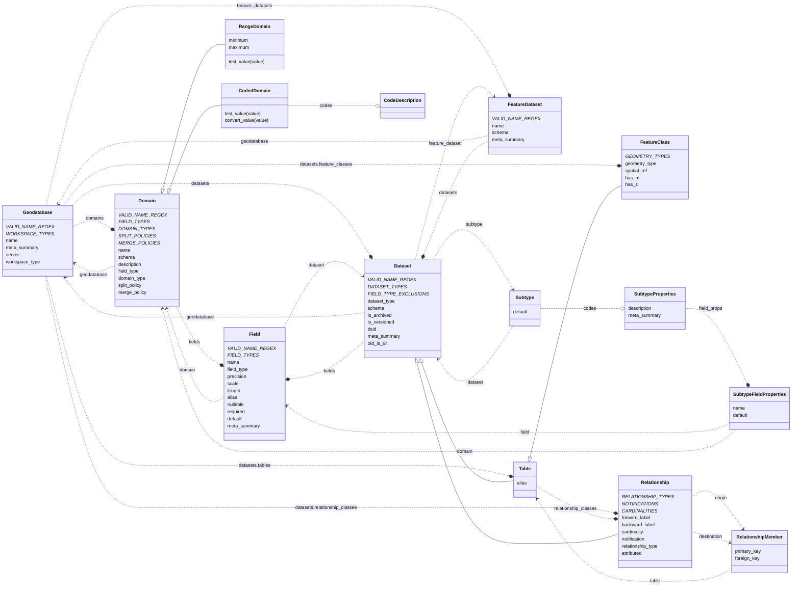
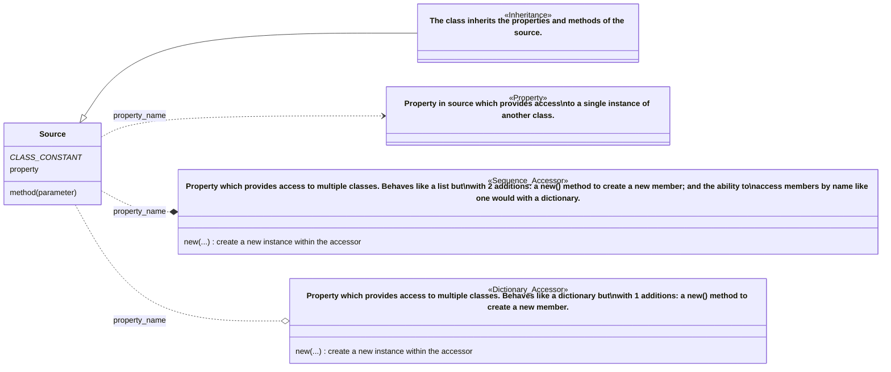

# Geodatabase Structure Classes

The geodatabase structure is used as the middle-man between a reader and a writer, storing the complete geodatabase structure in a standard format.

Interface readers must create a geodatabase structure instance from their source, and interface writers must read from a geodatabase structure to produce their output.

All classes, methods, and properties are documented with Python docstrings. The organization of the classes is documented below to provide an overview.

> ℹ **Note regarding editability**
> The structure was primarily created to allow creation of a Geodatabase instance from a known structure. Editing the properties or the structure of an existing Geodatabase instance isn't fully supported.

---

## Legend

